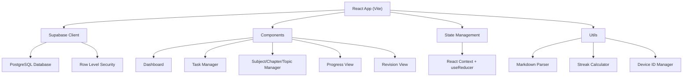
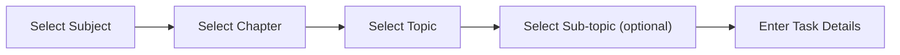

# Task Tracker — Implementation Plan

A study-oriented task tracker with hierarchical organization (Subject → Chapter → Topic → Sub-topic), progress tracking, streaks, and a premium dark-mode UI. No login/signup required. **All data stored in Supabase.**

---

## Confirmed Decisions

| Decision | Resolution |
|----------|-----------|
| **Data Storage** | All data stored in Supabase PostgreSQL — no localStorage-only data |
| **User Identity** | Device UUID generated once, stored in `localStorage`, sent as `x-device-id` header to scope Supabase RLS. Data tied to browser. |
| **Streak Calculation** | Consecutive days where **at least 1 task was completed** (based on `completed_at` timestamps) |
| **Revision Marker** | Visual badge/tag on the task card + dedicated filterable **"Revision" view** to see all revision-marked tasks |
| **Progress Calculation** | `completed tasks / total tasks` at **3 levels**: overall platform-wide, per subject, and per chapter |

> [!IMPORTANT]
> **Supabase Project Required**: You'll need to create a Supabase project and provide the **Project URL** and **Anon Key**. The app will store these in a `.env` file.

---

## Architecture Overview



---

## Database Schema (Supabase / PostgreSQL)

All 5 tables live in Supabase. RLS policies ensure each device can only access its own data.

### Tables

```sql
-- Subjects table
CREATE TABLE subjects (
  id UUID DEFAULT gen_random_uuid() PRIMARY KEY,
  device_id TEXT NOT NULL,
  name TEXT NOT NULL,
  color TEXT DEFAULT '#6366f1',  -- hex color for visual identity
  created_at TIMESTAMPTZ DEFAULT now(),
  UNIQUE(device_id, name)
);

-- Chapters table
CREATE TABLE chapters (
  id UUID DEFAULT gen_random_uuid() PRIMARY KEY,
  subject_id UUID NOT NULL REFERENCES subjects(id) ON DELETE CASCADE,
  device_id TEXT NOT NULL,
  name TEXT NOT NULL,
  created_at TIMESTAMPTZ DEFAULT now(),
  UNIQUE(subject_id, name)
);

-- Topics table
CREATE TABLE topics (
  id UUID DEFAULT gen_random_uuid() PRIMARY KEY,
  chapter_id UUID NOT NULL REFERENCES chapters(id) ON DELETE CASCADE,
  device_id TEXT NOT NULL,
  name TEXT NOT NULL,
  created_at TIMESTAMPTZ DEFAULT now(),
  UNIQUE(chapter_id, name)
);

-- Sub-topics table
CREATE TABLE sub_topics (
  id UUID DEFAULT gen_random_uuid() PRIMARY KEY,
  topic_id UUID NOT NULL REFERENCES topics(id) ON DELETE CASCADE,
  device_id TEXT NOT NULL,
  name TEXT NOT NULL,
  created_at TIMESTAMPTZ DEFAULT now(),
  UNIQUE(topic_id, name)
);

-- Tasks table
CREATE TABLE tasks (
  id UUID DEFAULT gen_random_uuid() PRIMARY KEY,
  device_id TEXT NOT NULL,
  subject_id UUID NOT NULL REFERENCES subjects(id) ON DELETE CASCADE,
  chapter_id UUID NOT NULL REFERENCES chapters(id) ON DELETE CASCADE,
  topic_id UUID NOT NULL REFERENCES topics(id) ON DELETE CASCADE,
  sub_topic_id UUID REFERENCES sub_topics(id) ON DELETE SET NULL,  -- optional
  title TEXT NOT NULL,
  description TEXT,
  priority TEXT CHECK (priority IN ('high', 'medium', 'low')),  -- optional
  due_date DATE,  -- optional
  is_completed BOOLEAN DEFAULT false,
  is_revision BOOLEAN DEFAULT false,  -- revision marker flag
  completed_at TIMESTAMPTZ,
  created_at TIMESTAMPTZ DEFAULT now(),
  updated_at TIMESTAMPTZ DEFAULT now()
);

-- Indexes for performance
CREATE INDEX idx_tasks_device_id ON tasks(device_id);
CREATE INDEX idx_tasks_subject_id ON tasks(subject_id);
CREATE INDEX idx_tasks_chapter_id ON tasks(chapter_id);
CREATE INDEX idx_tasks_completed ON tasks(device_id, is_completed);
CREATE INDEX idx_tasks_due_date ON tasks(device_id, due_date);
CREATE INDEX idx_tasks_revision ON tasks(device_id, is_revision);
CREATE INDEX idx_subjects_device_id ON subjects(device_id);
CREATE INDEX idx_chapters_device_id ON chapters(device_id);
```

### Row Level Security (RLS)

```sql
-- Enable RLS on all tables
ALTER TABLE subjects ENABLE ROW LEVEL SECURITY;
ALTER TABLE chapters ENABLE ROW LEVEL SECURITY;
ALTER TABLE topics ENABLE ROW LEVEL SECURITY;
ALTER TABLE sub_topics ENABLE ROW LEVEL SECURITY;
ALTER TABLE tasks ENABLE ROW LEVEL SECURITY;

-- Policies: allow anon role full CRUD scoped by device_id header
-- We pass device_id as a custom header: x-device-id

CREATE POLICY "subjects_policy" ON subjects
  FOR ALL TO anon
  USING (device_id = current_setting('request.headers', true)::json->>'x-device-id')
  WITH CHECK (device_id = current_setting('request.headers', true)::json->>'x-device-id');

CREATE POLICY "chapters_policy" ON chapters
  FOR ALL TO anon
  USING (device_id = current_setting('request.headers', true)::json->>'x-device-id')
  WITH CHECK (device_id = current_setting('request.headers', true)::json->>'x-device-id');

CREATE POLICY "topics_policy" ON topics
  FOR ALL TO anon
  USING (device_id = current_setting('request.headers', true)::json->>'x-device-id')
  WITH CHECK (device_id = current_setting('request.headers', true)::json->>'x-device-id');

CREATE POLICY "sub_topics_policy" ON sub_topics
  FOR ALL TO anon
  USING (device_id = current_setting('request.headers', true)::json->>'x-device-id')
  WITH CHECK (device_id = current_setting('request.headers', true)::json->>'x-device-id');

CREATE POLICY "tasks_policy" ON tasks
  FOR ALL TO anon
  USING (device_id = current_setting('request.headers', true)::json->>'x-device-id')
  WITH CHECK (device_id = current_setting('request.headers', true)::json->>'x-device-id');
```

---

## Feature Specifications

### 1. Dashboard

The landing page with 4 glassmorphic stat cards and a recent activity feed.

| Stat Card | Calculation | Icon |
|-----------|-------------|------|
| **Total Tasks** | Count of all tasks in Supabase for this device | 📋 |
| **Completed Tasks** | Count where `is_completed = true` | ✅ |
| **Today's Tasks** | Count where `due_date = today` OR `created_at = today` | 📅 |
| **Current Streak** | Consecutive days (from today backwards) with ≥1 task where `completed_at` falls on that day | 🔥 |

Also includes:
- **Overall Platform Progress Bar**: `total completed / total tasks` across all subjects — displayed prominently at top
- **Recent Tasks**: Last 5 tasks created or completed, with quick-complete toggle

---

### 2. Task Management

#### 2.1 Task Creation Flow (Step-by-step Wizard)



At each step:
- Show **existing list** as selectable chips/cards
- If list is empty → show **"Add New"** button/input directly
- If list has items → show items + **"+ Add New"** option at bottom
- User can create a new item inline (name input + save) without leaving the wizard

#### 2.2 Task Details (Step 5)
- **Title** (required)
- **Description** (optional text)
- **Priority**: High / Medium / Low — optional, defaults to none
- **Due Date**: Date picker — optional
- **Revision Marker**: Toggle switch — marks task for revision

#### 2.3 Bulk Task Creation
- After selecting Subject → Chapter → Topic → Sub-topic context
- Text area: enter **multiple task titles** (one per line)
- All tasks inherit the same hierarchy context + shared priority/due date (optional)

#### 2.4 Markdown Import
- Drag-and-drop file upload zone OR text area paste
- Preview parsed tasks in a table before confirming import
- Creates hierarchy (subjects, chapters, topics, sub-topics) if they don't already exist

#### 2.5 Task Actions
- **Edit**: Opens task form pre-filled — can change any field including hierarchy
- **Delete**: Confirmation dialog → soft removal from Supabase
- **Mark Complete**: Toggle checkbox → sets `is_completed = true`, `completed_at = now()`
- **Mark Revision**: Toggle badge → sets `is_revision = true`

---

### 3. Revision View

A dedicated filterable view showing **only tasks with `is_revision = true`**.

- Accessed from sidebar navigation (4th nav item)
- Same card layout as TaskList but filtered
- Shows subject/chapter breadcrumb on each card for context
- Can toggle revision off to remove from this view
- Filter by subject or completion status within revision view

---

### 4. Progress View

Three levels of progress visualization:

#### 4.1 Overall Platform Progress
- Large animated progress bar at the top
- Shows `X / Y tasks completed (Z%)`
- Gradient fill from indigo → green as percentage increases

#### 4.2 Per-Subject Progress
- Card for each subject with its assigned color
- Circular progress indicator OR horizontal bar
- Shows `completed / total` count and percentage
- Click to expand → reveals chapter-level breakdown

#### 4.3 Per-Chapter Progress
- Nested within subject cards (expandable)
- Horizontal progress bars with chapter name
- Shows `completed / total` count

---

### 5. Streak Calculation Logic

```
1. Fetch all tasks where is_completed = true AND completed_at IS NOT NULL
2. Extract dates from completed_at (normalize to local date)
3. Deduplicate dates → get set of unique completion dates
4. Starting from today, walk backwards:
   - If today has completions → streak starts at 1, check yesterday
   - If today has NO completions → check yesterday (allow "today not yet done")
   - Continue until a day with no completions is found
5. Return streak count
```

---

## Markdown Import Format (Example for Users)

Users can upload a `.md` file to bulk-create tasks. Here's the example format:

```markdown
# Subject: Physics

## Chapter: Mechanics
### Topic: Newton's Laws
#### Sub-topic: First Law of Motion
- [ ] Read about inertia and rest | priority: high | due: 2026-06-15 | revision: true
- [ ] Solve numerical problems on inertia
- [ ] Watch video lecture on Newton's First Law | priority: medium

#### Sub-topic: Second Law of Motion
- [ ] Derive F = ma from first principles | priority: high
- [ ] Practice 10 numerical problems | due: 2026-06-18

### Topic: Work, Energy & Power
#### Sub-topic: Kinetic Energy
- [ ] Study kinetic energy derivation | priority: low
- [ ] Solve worksheet problems

## Chapter: Thermodynamics
### Topic: Laws of Thermodynamics
- [ ] Read about Zeroth Law | priority: medium | due: 2026-06-20
- [ ] Study First Law and internal energy
```

**Format Rules:**
- `# Subject: <name>` — Creates or selects a subject
- `## Chapter: <name>` — Creates or selects a chapter under the current subject
- `### Topic: <name>` — Creates or selects a topic under the current chapter
- `#### Sub-topic: <name>` — (Optional) Creates or selects a sub-topic under the current topic
- `- [ ] <task title>` — Creates a task (use `- [x]` for already completed)
- Optional inline metadata after `|`: `priority: high|medium|low`, `due: YYYY-MM-DD`, `revision: true`
- Tasks without a sub-topic heading are created without a sub-topic association

---

## Project Structure

```
task-tracker/
├── public/
│   └── favicon.svg
├── src/
│   ├── components/
│   │   ├── Layout/
│   │   │   ├── Sidebar.jsx           # Navigation sidebar (bottom tab on mobile)
│   │   │   ├── Header.jsx            # Top bar with search/filter
│   │   │   └── Layout.jsx            # Main layout wrapper
│   │   ├── Dashboard/
│   │   │   ├── Dashboard.jsx         # Main dashboard view
│   │   │   ├── StatCard.jsx          # Individual stat card (glassmorphism)
│   │   │   └── StreakDisplay.jsx     # Streak visualization with fire animation
│   │   ├── Tasks/
│   │   │   ├── TaskList.jsx          # Task list with filters & sorting
│   │   │   ├── TaskCard.jsx          # Individual task card with actions
│   │   │   ├── TaskForm.jsx          # Step-by-step create/edit wizard
│   │   │   ├── BulkTaskForm.jsx      # Add multiple tasks at once
│   │   │   └── MarkdownImport.jsx    # Upload .md file for bulk import
│   │   ├── Hierarchy/
│   │   │   ├── SubjectSelector.jsx   # Subject picker with inline add
│   │   │   ├── ChapterSelector.jsx   # Chapter picker with inline add
│   │   │   ├── TopicSelector.jsx     # Topic picker with inline add
│   │   │   └── SubTopicSelector.jsx  # Sub-topic picker with inline add
│   │   ├── Progress/
│   │   │   ├── ProgressView.jsx      # Full progress page (all 3 levels)
│   │   │   ├── OverallProgress.jsx   # Platform-wide progress bar
│   │   │   ├── SubjectProgress.jsx   # Per-subject progress card
│   │   │   └── ChapterProgress.jsx   # Per-chapter nested progress bar
│   │   ├── Revision/
│   │   │   └── RevisionView.jsx      # Filterable revision-only task list
│   │   └── common/
│   │       ├── Modal.jsx             # Reusable modal (<dialog> based)
│   │       ├── Button.jsx            # Styled gradient button
│   │       ├── Badge.jsx             # Priority + revision badges
│   │       ├── ProgressBar.jsx       # Reusable animated progress bar
│   │       ├── EmptyState.jsx        # Empty state with CTA
│   │       └── ConfirmDialog.jsx     # Delete confirmation dialog
│   ├── context/
│   │   └── AppContext.jsx            # Global state (React Context + useReducer)
│   ├── hooks/
│   │   ├── useSubjects.js            # CRUD for subjects
│   │   ├── useChapters.js            # CRUD for chapters
│   │   ├── useTopics.js              # CRUD for topics
│   │   ├── useSubTopics.js           # CRUD for sub-topics
│   │   ├── useTasks.js               # CRUD for tasks + bulk operations
│   │   └── useDashboard.js           # Dashboard stats + streak + overall progress
│   ├── lib/
│   │   └── supabase.js               # Supabase client with x-device-id header
│   ├── utils/
│   │   ├── deviceId.js               # Generate/retrieve device UUID from localStorage
│   │   ├── markdownParser.js         # Parse .md into structured task objects
│   │   ├── streakCalculator.js       # Calculate consecutive completion days
│   │   └── constants.js              # Colors, priorities, subject colors palette
│   ├── App.jsx                       # App root with React Router
│   ├── App.css                       # Component-specific styles
│   ├── index.css                     # Global design system (dark mode)
│   └── main.jsx                      # Entry point
├── .env.example                      # Template for Supabase credentials
├── supabase-schema.sql               # Full SQL schema for easy setup
├── package.json
├── vite.config.js
└── index.html
```

---

## Proposed Changes

### 1. Project Setup

#### [NEW] Project initialization with Vite + React

- Initialize with `npx create-vite@latest ./ --template react`
- Install dependencies: `@supabase/supabase-js`, `react-router-dom`, `react-hot-toast`, `lucide-react` (icons), `uuid`
- Create `.env.example` with `VITE_SUPABASE_URL` and `VITE_SUPABASE_ANON_KEY` placeholders
- Create `supabase-schema.sql` with the full DDL above for one-click database setup

---

### 2. Design System & Global Styles

#### [NEW] [index.css](file:///Users/vikaskumar/.gemini/antigravity-ide/scratch/task-tracker/src/index.css)

Premium dark-mode design system with:
- **Color palette**: Deep navy/slate backgrounds (`#0a0a1a`, `#12122a`), vibrant accent gradients (indigo → violet → cyan)
- **Typography**: Google Font `Inter` for clean readability
- **Glassmorphism**: `backdrop-filter: blur()` + semi-transparent backgrounds on cards
- **Shadows**: Layered glow shadows with accent color tinting
- **Animations**: Smooth `@keyframes` for fade-in, slide-up, pulse, shimmer, count-up effects
- **CSS Custom Properties**: Full token system for spacing, radii, colors
- **Responsive**: Mobile-first with breakpoints at 768px and 1024px
- **`color-scheme: dark`** for native dark scrollbars and form controls
- **`prefers-reduced-motion`** respected for accessibility

---

### 3. Supabase Integration

#### [NEW] [supabase.js](file:///Users/vikaskumar/.gemini/antigravity-ide/scratch/task-tracker/src/lib/supabase.js)

- Initialize Supabase client with `VITE_SUPABASE_URL` and `VITE_SUPABASE_ANON_KEY`
- Inject `x-device-id` as a global custom header so RLS policies can scope data per device

#### [NEW] [deviceId.js](file:///Users/vikaskumar/.gemini/antigravity-ide/scratch/task-tracker/src/utils/deviceId.js)

- Check `localStorage` for existing `device_id`
- If not found, generate a new UUID v4 and persist it
- Export `getDeviceId()` function

---

### 4. Custom Hooks (Data Layer)

All hooks perform Supabase queries. No local-only data.

#### [NEW] [useSubjects.js](file:///Users/vikaskumar/.gemini/antigravity-ide/scratch/task-tracker/src/hooks/useSubjects.js)
- `fetchSubjects()`, `createSubject(name, color)`, `deleteSubject(id)`

#### [NEW] [useChapters.js](file:///Users/vikaskumar/.gemini/antigravity-ide/scratch/task-tracker/src/hooks/useChapters.js)
- `fetchChapters(subjectId)`, `createChapter(subjectId, name)`, `deleteChapter(id)`

#### [NEW] [useTopics.js](file:///Users/vikaskumar/.gemini/antigravity-ide/scratch/task-tracker/src/hooks/useTopics.js)
- `fetchTopics(chapterId)`, `createTopic(chapterId, name)`, `deleteTopic(id)`

#### [NEW] [useSubTopics.js](file:///Users/vikaskumar/.gemini/antigravity-ide/scratch/task-tracker/src/hooks/useSubTopics.js)
- `fetchSubTopics(topicId)`, `createSubTopic(topicId, name)`, `deleteSubTopic(id)`

#### [NEW] [useTasks.js](file:///Users/vikaskumar/.gemini/antigravity-ide/scratch/task-tracker/src/hooks/useTasks.js)
- Full CRUD: `fetchTasks(filters)`, `createTask(data)`, `createBulkTasks(tasks[])`, `updateTask(id, data)`, `deleteTask(id)`, `toggleComplete(id)`, `toggleRevision(id)`
- Filters: by subject, chapter, priority, due date, revision status, completion status

#### [NEW] [useDashboard.js](file:///Users/vikaskumar/.gemini/antigravity-ide/scratch/task-tracker/src/hooks/useDashboard.js)
- **Stats**: total tasks, completed count, today's tasks, current streak
- **Overall progress**: `completed / total` across entire platform
- **Per-subject progress**: `completed / total` grouped by `subject_id`
- **Per-chapter progress**: `completed / total` grouped by `chapter_id`

---

### 5. Core Components

#### [NEW] Layout Components
- **Sidebar.jsx**: Collapsible sidebar with nav links (Dashboard, Tasks, Progress, Revision), glassmorphism background. Becomes a bottom tab bar on mobile.
- **Header.jsx**: Page title, global search, filter toggles
- **Layout.jsx**: Wraps sidebar + content area with responsive grid

#### [NEW] Dashboard Components
- **Dashboard.jsx**: Overall progress bar at top + 4 stat cards in responsive grid + recent tasks list + quick-add FAB
- **StatCard.jsx**: Glassmorphic card with animated counter, icon, gradient accent border
- **StreakDisplay.jsx**: 🔥 fire emoji + streak count with pulse animation, shows last 7 days as dot indicators

#### [NEW] Task Components
- **TaskList.jsx**: Filterable/sortable list (by subject, priority, due date, revision status, completion). Card layout.
- **TaskCard.jsx**: Card with checkbox, title, subject/chapter breadcrumb, priority badge, due date chip, revision badge (purple pulsing), edit/delete actions. Checkbox animation on complete.
- **TaskForm.jsx**: Step-by-step wizard (Subject → Chapter → Topic → Sub-topic → Details) with inline-create capability at each step
- **BulkTaskForm.jsx**: After selecting hierarchy context, text area for multiple task titles (one per line), shared optional priority/due date
- **MarkdownImport.jsx**: Drag-and-drop file upload + text area paste + preview table → confirm import

#### [NEW] Hierarchy Selectors
- **SubjectSelector.jsx**: Selectable chips with search + inline "Create New" with color picker
- **ChapterSelector.jsx**: Same pattern, filtered by selected subject
- **TopicSelector.jsx**: Same pattern, filtered by selected chapter
- **SubTopicSelector.jsx**: Same pattern, filtered by selected topic (optional step)

#### [NEW] Progress Components
- **ProgressView.jsx**: Full page — overall bar at top, then subject cards, each expandable to chapter bars
- **OverallProgress.jsx**: Large animated bar showing platform-wide `completed / total (percentage)`
- **SubjectProgress.jsx**: Subject card with color, progress bar, `completed/total` count, expandable
- **ChapterProgress.jsx**: Nested horizontal bars within subject, `completed/total` per chapter

#### [NEW] Revision Components
- **RevisionView.jsx**: Dedicated page showing only `is_revision = true` tasks. Filterable by subject, completion status. Same TaskCard component with revision badge highlighted.

#### [NEW] Common Components
- **Modal.jsx**: Animated modal with backdrop blur, `<dialog>` element for accessibility
- **Button.jsx**: Gradient buttons with hover glow effects
- **Badge.jsx**: Priority badges (red glow = high, amber = medium, blue = low) + revision badge (purple pulsing)
- **ProgressBar.jsx**: Reusable animated horizontal progress bar with gradient fill
- **EmptyState.jsx**: Friendly illustration + CTA when no data exists
- **ConfirmDialog.jsx**: Delete confirmation with cancel/confirm buttons

---

### 6. Utilities

#### [NEW] [markdownParser.js](file:///Users/vikaskumar/.gemini/antigravity-ide/scratch/task-tracker/src/utils/markdownParser.js)

- Regex-based line-by-line parser
- Extracts hierarchy headings (`#`, `##`, `###`, `####`)
- Extracts task items (`- [ ]` / `- [x]`)
- Parses inline metadata (`priority`, `due`, `revision`) from `|`-separated values
- Returns structured array of task objects ready for bulk insert into Supabase

#### [NEW] [streakCalculator.js](file:///Users/vikaskumar/.gemini/antigravity-ide/scratch/task-tracker/src/utils/streakCalculator.js)

- Takes array of `completed_at` timestamps from Supabase
- Groups by local date, deduplicates
- Walks backwards from today counting consecutive days with ≥1 completion
- Returns current streak count (number)

---

### 7. Routing & App Shell

#### [NEW] [App.jsx](file:///Users/vikaskumar/.gemini/antigravity-ide/scratch/task-tracker/src/App.jsx)

- React Router with 4 main routes:
  - `/` → Dashboard
  - `/tasks` → Task Management (list + create/edit)
  - `/progress` → Progress View (overall + subject + chapter)
  - `/revision` → Revision View (filtered revision tasks)
- Wrapped in `AppContext.Provider` for global state
- Animated route transitions

---

## UI Design Details

### Color System
| Token | Value | Usage |
|-------|-------|-------|
| `--bg-primary` | `#0a0a1a` | Page background |
| `--bg-secondary` | `#12122a` | Card backgrounds |
| `--bg-tertiary` | `#1a1a3e` | Elevated elements |
| `--glass` | `rgba(255,255,255,0.05)` | Glassmorphic surfaces |
| `--glass-border` | `rgba(255,255,255,0.1)` | Glass borders |
| `--accent-1` | `#6366f1` | Primary indigo |
| `--accent-2` | `#8b5cf6` | Violet |
| `--accent-3` | `#06b6d4` | Cyan |
| `--text-primary` | `#f1f5f9` | Main text |
| `--text-secondary` | `#94a3b8` | Muted text |
| `--success` | `#22c55e` | Completed state |
| `--warning` | `#f59e0b` | Medium priority |
| `--danger` | `#ef4444` | High priority |
| `--revision` | `#a855f7` | Revision badge purple |

### Animations
- **Cards**: Fade-in + slide-up on mount (staggered)
- **Checkboxes**: Satisfying bounce + brief glow on complete
- **Progress bars**: Smooth width transition with gradient shimmer
- **Stat counters**: Count-up animation on dashboard load
- **Hover effects**: Subtle scale(1.02) + glow intensification
- **Page transitions**: Crossfade between routes
- **Revision badge**: Subtle pulse animation

### Mobile Responsiveness
- **< 768px**: Sidebar becomes bottom tab bar (4 icons), single-column layout, full-width cards, touch-friendly hit targets (min 44px)
- **768px–1024px**: Compact sidebar (icons only), 2-column grid
- **> 1024px**: Full sidebar with labels, 3–4 column dashboard grid

---

## Verification Plan

### Manual Verification
1. Run `npm run dev` and verify all 4 pages render correctly
2. Test task creation wizard: Subject → Chapter → Topic → Sub-topic → Task
3. Test inline creation at each hierarchy step (add new subject/chapter/topic/sub-topic)
4. Test bulk task creation (multiple tasks in one form)
5. Test markdown file import with the example format — verify preview and confirm
6. Verify dashboard stats update after task operations (total, completed, today's, streak)
7. Verify **overall platform progress bar** accuracy
8. Verify **per-subject** and **per-chapter** progress bars accuracy
9. Test Revision view: mark tasks for revision → appears in Revision view → toggle off → disappears
10. Test on mobile viewport (Chrome DevTools device emulation)
11. Verify streak calculation correctly counts consecutive completion days
12. Test all CRUD operations (create, read, update, delete) for tasks and hierarchy items
13. Verify edit flow: change task title, priority, due date, hierarchy
14. Verify delete with confirmation dialog

### Build Verification
```bash
npm run build  # Ensure no build errors
npm run preview  # Verify production bundle works
```
